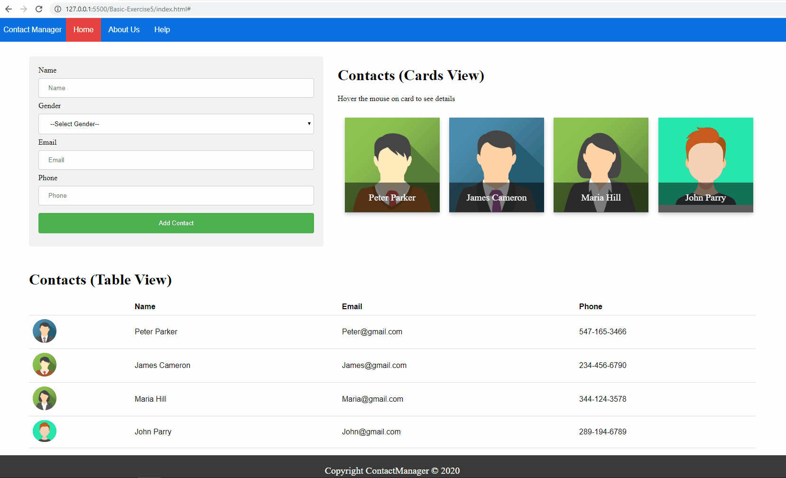

## PRMC1 - HTML5 & CSS3

### Basic Exercise-5

### Concepts Covered
- Border,Color,Background,Gradients,Text Overflow,Drop Shadows,2D Transforms,3D Transforms,Transitions,Animations, Multi-Column Layouts,Box Sizing,Flexbox,Filters,Media Queries
- Cursors, Overflow, Dimension, Units(em, ex), Positioning, Layers, floating elements, Alignment, Pseudo-classes and Pseudo-elements, Media types, Sprites, Opacity

### Problem Statement
Create a responsive webpage for Contact Manager application.
- Page should be responsive and adjust the content based on different screen sizes.
- Whole page should be containerized in div element with the margin of 50px from both sides (left & right).
- In the header of the page add navigation bar.
    - Add heading `Contact Manager` on the left side of the navbar.
    - Add nav links - `Home`, `About Us` & `Help`.
    - While opening the page in small screen devices such as mobile phone the navbar should automatically hide nav links and display menu icon on left side of the navbar.
    - Menu can be revealed by hovering the mouse on menu icon of navbar.
- In the body section at left side create a form for adding a new contact with below fields.
    - Name (Textfield)
    - Gender (Dropdown list)
    - Email (Textfield)
    - Phone (Textfield)
    - Add Contact button
- In the body section at right side display 4 contacts in cards view.
    - Card should display the avatar image (Any image can be used) with Name of contact at the bottom of the card with transparent background (overlay effect).
    - Card should flip with animation and display the contact details of the person when you hover the mouse on card.
- Next you need to show the contacts in table format.
    - Add 4 columns - `Photo`, `Name`, `Email`, `Phone`.
    - Display avatar image in first column in circle shape.
    - Add the hover effect on each row to change the background color.
- In addition at the bottom of the page create a footer.
    - Footer should contain the copright information with copyright symbol.
    - Also add some description which should be displayed in multicolumn format with 3 colums.
- Finally the webpage should look like & behave as shown below
